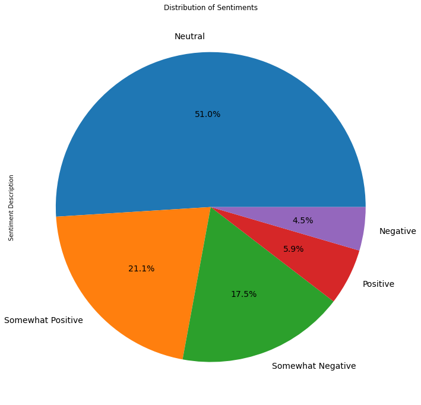
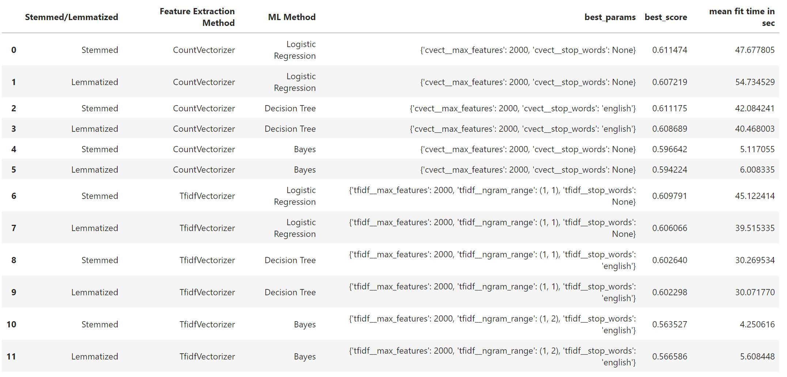
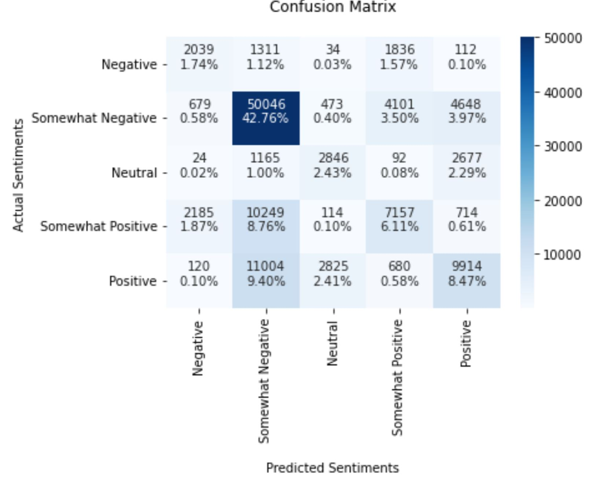

### Sentiments on movie reviews

**FONG Sze Wing**

#### Executive summary

Movie reviews are labelled with sentiments like negative, somewhat negative, neutral, somewhat positive, positive. Natural Language processing techniques are used to understand the sentiment in the moview reviews. Based on the model I built, movies can be recommended/not recommended to people. It can also help the filming industry know what kind of movies the large audience likes to watch.

The distribution of sentiments in the dataset is as follow:

I have first applied stemming and lemmatizing to preprocess the data. Stemming is a technique to lower inflection in words to their root forms. For example, changes, changed, changing would all be stemmed into chang; while lemmatizing is to remove inflectional endings only and to return the base or dictionary form of a word. For example, changes, changed, changing would all be lemmatized into change.

After stemming and lemmatizing, I used GridSearchCV to find the best machine learning model. The machine learning methods I have used include CountVectorizer, TfidfVectorizer, Logistic Regression, DecisionTreeClassifier and Naive Bayes. To balance between auuracy score and time used to build the model, I found that Stemmed Content + CountVectorizer with Decision Tree is the best among all methods. 

The mean cross validation score for the best model with stemming is 0.6042 (std:  0.0019 ), Precision is 0.5973, Recall is 0.6152 and the F1 score is 0.5969 .

The scores, best parameters and fit times of different methods used are as follows:

The confusion matrix of the model is as follows:

By inputting new phrases or sentences, the model can tell the sentiment of the review. Hence, the movie rating can be indirectly deduced.

#### Rationale

There are millions of movies in the world. For Netflix, there were around 20k titles. It is difficult to tell which movie is worthwhile watching. Sentiment Analysis on movie reviews can help people to know whether the movie is good or not before watching. It is somehow like collective intelligence. It can save a lot of their time and money when choosing movie to watch. 

At the same time, it can let the movie producers know how to improve the movie quality by understanding audiences' feelings.

#### Research Question
I am trying to help movie watchers to choose movies, and help movie producers improve the movie quality.

#### Data Sources
Data were downloaded from https://www.kaggle.com/competitions/sentiment-analysis-on-movie-reviews/data , which are the Rotten Tomatoes movie reviews. The dataset is a corpus of movie reviews used for sentiment analysis, originally collected by Pang and Lee (Pang and L. Lee. 2005. Seeing stars: Exploiting class relationships for sentiment categorization with respect to rating scales. In ACL, pages 115–124.)

I have checked the dataset by using isna(). There is no empty row in the dataset.

#### Methodology
Natural Language Processing, N-gram

#### Results
Movie reviews are labelled with sentiments like negative, somewhat negative, neutral, somewhat positive, positive.
Based on the sentiments, recommend/not recommend the movie to people.

#### Outline of project

- https://github.com/crystalsw/Capstone-Project/blob/master/Capstone%20Project.ipynb (Data Exploration, Preprocessing, Modeling, Prediction, Evaluation)

##### Contact and Further Information
1) Instead of removing name tags in the text, maybe try to extract the tokenized verb for classification
2) Try more parameters in GridSearchCV
3) Apart from GridSearchCV, maybe try HalvingGridSearchCV to find the best model 
4) Apart from Logistic Regression, Bayers, Decision Tree, use other methods.
5) Since the original dataset was preprocessed, a sentence is divided into pieces. Maybe try to take the longest sentence in each PhraseId and rebuild the model
6) Filter the spam texts before building the sentiment analysis model